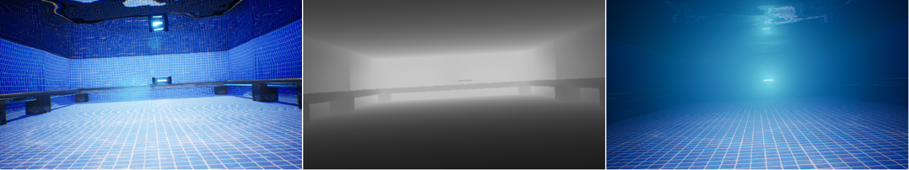
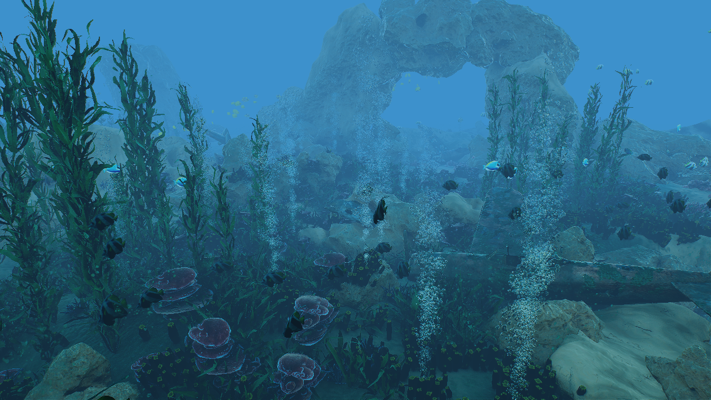

# OpenWaters

This repo is a work in progress

## Official Repository for [OpenWaters: Photorealistic Simulations for Underwater Computer Vision](https://doi.org/10.1145/3491315.3491336)

OpenWaters is a simulation tool made in Unreal Engine for generating massive underwater computer vision datasets. OpenWaters supports creation of massive amount of underwater images by emulating diverse real-world conditions. It allows for fine controls over every variable in a simulation instance, including geometry, rendering parameters like ray-traced water caustics, scattering, and ground-truth labels.

  

  

  
  

  

  

**RELEASE version: 1.00**
    
 

|Item| Link |
|--|--|
| OpenWaters v1.00 Project Files (Must run on [NvRTX UE4.26-Caustics](https://lens.cs.gsu.edu/))| [Coming Soon](https://lens.cs.gsu.edu/) |
| OpenWaters-Depth Dataset | [Coming Soon](https://lens.cs.gsu.edu/) |
    

**Contact: 
If you have questions or comments (or bugs!) please open a github issue or contact me at:
mehdimousavi.redcap[at]gmail[dot]com**

## Citation:
If you end up using OpenWaters or The Neural Networks, please cite our paper: 

    @misc{mousavi2021openWaters,
      title={OpenWaters: Photorealistic Simulations For Underwater Computer Vision}, 
      author={Mehdi Mousavi, Shardul Vaidya, Razat Sutradhar, and Ashwin Ashok},
      year={2021}
      }
