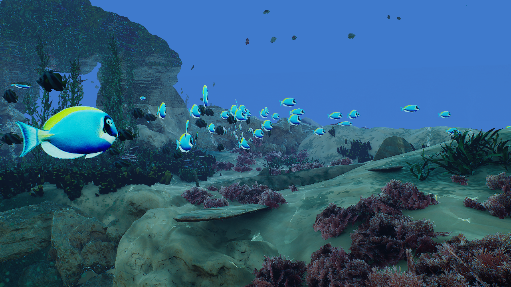

# OpenWaters

This repo is a work in progress

## Official Repository for [OpenWaters: Photorealistic Simulations for Underwater Computer Vision](https://doi.org/10.1145/3491315.3491336)

OpenWaters is a simulation tool made in Unreal Engine for generating massive underwater computer vision datasets. OpenWaters supports creation of massive amount of underwater images by emulating diverse real-world conditions. It allows for fine controls over every variable in a simulation instance, including geometry, rendering parameters like ray-traced water caustics, scattering and ground-truth labels.

  

  

  
 

  

  
     
 

  

 
  

**RELEASE version: 1.00**
    
 

|Item| Link |
|--|--|
| OpenWaters v1.00 Project Files (Must run on [NvRTX UE4.26-Caustics](https://lens.cs.gsu.edu/))| [Coming Soon](https://lens.cs.gsu.edu/) |
| OpenWaters-Depth Dataset | [Coming Soon](https://lens.cs.gsu.edu/) |
    

**Contact: 
If you have questions or comments (or bugs!) please open a github issue or contact me at:
mehdimousavi.redcap[at]gmail[dot]com**

## Citation:
If you end up using OpenWaters or The Neural Networks, please cite our paper: 

    @inproceedings{10.1145/3491315.3491336,
    author = {Mousavi, Mehdi and Vaidya, Shardul and Sutradhar, Razat and Ashok, Ashwin},
    title = {OpenWaters: Photorealistic Simulations For Underwater Computer Vision},
    year = {2021},
    isbn = {9781450395625},
    publisher = {Association for Computing Machinery},
    address = {New York, NY, USA},
    url = {https://doi.org/10.1145/3491315.3491336},
    doi = {10.1145/3491315.3491336},
    abstract = { In this paper, we present OpenWaters, a real-time open-source underwater simulation kit for generating photorealistic underwater scenes. OpenWaters supports creation of massive amount of underwater images by emulating diverse real-world conditions. It allows for fine controls over every variable in a simulation instance, including geometry, rendering parameters like ray-traced water caustics, scattering, and ground-truth labels. Using underwater depth (distance between camera and object) estimation as the use-case, we showcase and validate the capabilities of OpenWaters to model underwater scenes that are used to train a deep neural network for depth estimation. Our experimental evaluation demonstrates depth estimation using synthetic underwater images with high accuracy, and feasibility of transfer-learning of features from synthetic to real-world images. },
    booktitle = {The 15th International Conference on Underwater Networks &amp; Systems},
    articleno = {3},
    numpages = {5},
    location = {Shenzhen, Guangdong, China},
    series = {WUWNet'21}
    }

